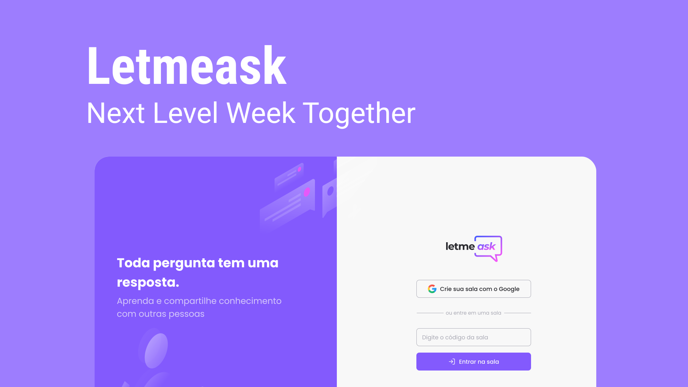

<h2>Site published <a href="https://letmeaskgreen.vercel.app/">here</a></h2>

## Technologies

This project was developed with the following technologies:

- React
- Firebase: Auth & Realtime Database
- Sass
- Phosphor-React: Icons
- Typescript
- Vite JS

## Project

Letmeask is perfect for content creators to be able to create Q&A rooms with their audience, in a very organized and democratic way.
