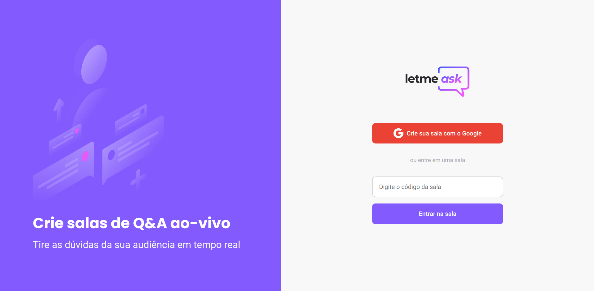
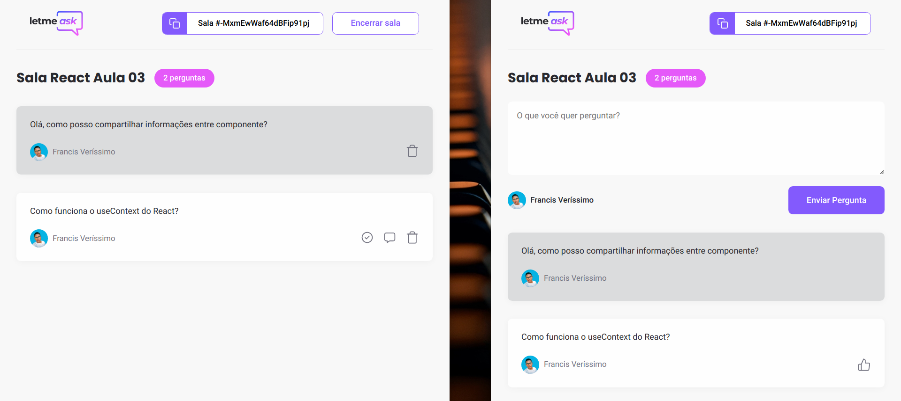

<p align="center">
  
</p>

<p align="center">
     
</p>

<p align="center">
  
  
</p>

<h2 align="center">Site published <a href="https://letmeask-3b93b.firebaseapp.com/">here</a></h2>

## 🧪 Technologies

This project was developed with the following technologies:

- [React](https://reactjs.org)
- [Firebase](https://firebase.google.com/)
- [TypeScript](https://www.typescriptlang.org/)

## 🚀 How to run

Clone the project and access its folder

```bash
$ git clone https://github.com/rocketseat-education/nlw-06-reactjs
$ cd nlw-06-reactjs
```

To start it, follow the steps below:

```bash
# install dependencies
$ yarn

# start the project
$ yarn start
```

The application is available in your browser at "localhost:3000".

Remembering that you will need to create a [Firebase](https://firebase.google.com/) account and a project to provide a Realtime Database.

## 💻 Project

Letmeask is perfect for content creators to be able to create Q&A rooms with their audience, in a very organized and democratic way.
